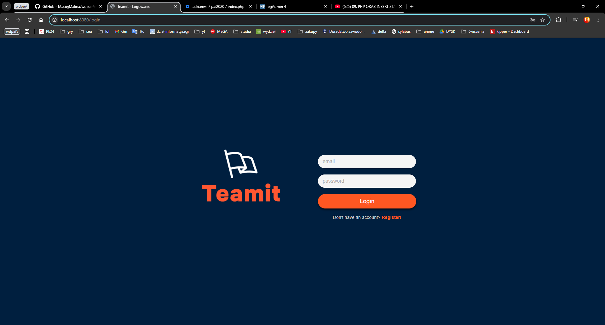
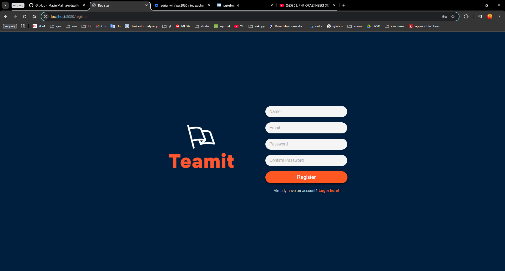
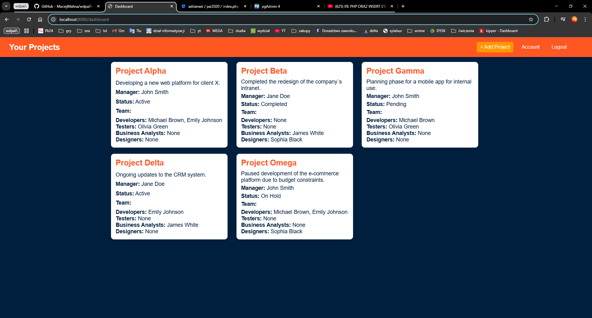
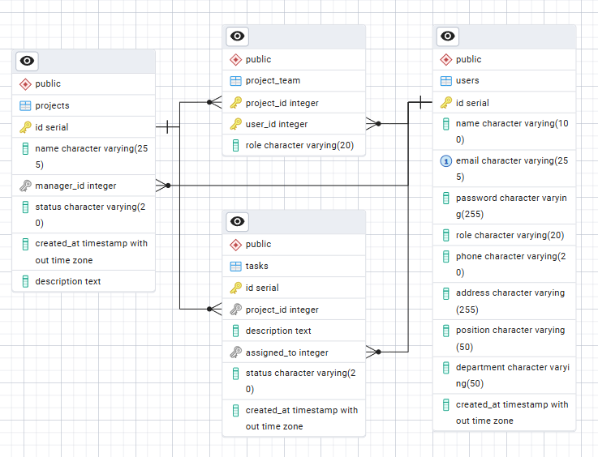

# TeamIT – System Zarządzania Projektami
TeamIT to webowa aplikacja do zarządzania projektami, umożliwiająca administratorom, managerom oraz członkom zespołu organizowanie i monitorowanie pracy.
Aplikacja pozwala na:
- Tworzenie i zarządzanie projektami,
- Przypisywanie użytkowników do zespołów,
- Tworzenie i śledzenie zadań,
- Kontrolowanie ról i uprawnień użytkowników.

# Technologie
- PHP
- CSS
- JavaScript
- PostgreSQL
- PDO
- nginx
- pgAdmin

# Pobranie aplikacji:
```
git clone https://github.com/MaciejMalina/wdpaiProject
```

# Uruchamianie:
## PC
1. Otwórz pobrane repozytorium w np. Visual Studio Code
2. Uruchom aplikacje Docker
3. Zbuduj docker-compose
```
docker-compose up --build
```
4. Po załadowaniu wszystkich kontenerów i serwisów udaj się w przeglądarce na adres http://localhost:8080/
5. Zaloguj się na utworzonych już użytkowników lub utwórz własne konto za pomocą "Register!" 

## Smartphone
1. Kroki 1-3 wykonać na PC
2. Otwieramy konsole CMD i wpisujemy
```
ipconfig
```
3. Znajdujemy swoje IPv4
4. Wchodzimy w przeglądarkę na smartphonie i wpisujemy [adres IPv4]:8080 np. 192.168.1.1:8080

# Dostępni użytkownicy
## Admin:
Login: maciej.malina@gmail.com
Hasło: password1

## Manager:
Login: john.smith@example.com
Hasło: password2

## Zwykły user:
Login: michael.brown@example.com
Hasło: password5

# Opis działania podstron
## Strona logowania (/login)
Pozwala użytkownikom na zalogowanie się do systemu.
Weryfikacja danych w bazie PostgreSQL.
Po zalogowaniu użytkownik jest przekierowywany na /dashboard.

## Dashboard (/dashboard)
Strona główna po zalogowaniu.
Wyświetla listę projektów dostępnych dla użytkownika:
Admin widzi wszystkie projekty.
Manager widzi tylko swoje projekty.
Developer, Tester, Analyst, Designer widzą projekty, w których mają przypisane zadania.
Możliwość przejścia do strony szczegółów projektu (/project/{id}).
Przyciski do dodania nowego projektu (/addProject).

## Strona profilu (/profile)
Umożliwia użytkownikowi edycję swoich danych.
Możliwość zmiany:
Imienia i nazwiska, E-maila, Hasła, Numeru telefonu, Adresu, Stanowiska i działu.

## Strona dodawania projektu (/addProject)
Formularz do dodawania nowego projektu.
Możliwość:
Wprowadzenia nazwy projektu,
Dodania opisu,
Wyboru menedżera (lista wszystkich managerów i adminów),
Dodania członków zespołu z podziałem na role.

## Strona szczegółów projektu (/project/{id})
Wyświetla pełne informacje o projekcie:
Nazwa projektu, Opis, Status, Manager,
Lista członków zespołu z przypisanymi rolami.
Admin i Manager mogą edytować projekt oraz dodawać członków zespołu.
Wszyscy użytkownicy widzą listę zadań projektu.
Możliwość dodawania nowych zadań (/addTask) przez managerów i admina.

# Logowanie do pgAdmin'a
1. Aby dostać się do pgAdmina wpisz w przeglądarke localhost:5050/
2. Zaloguj sie: Login - support@teamit.com    Hasło - password
3. Utwórz nowy serwer: 
Name - [nasza nazwa serwera], 
Connections/Hostname - postgres, 
Connection/Username - user,
Connection/Password - password
4. Gotowe, rozwiń zakładkę Servers/Database/teamit

# Struktura katalogów
```
/cocker
    /nginx
        - Dockerfile
        - nginx.conf
    /php
        - Dockerfile
    /postgres
        - init.sql

/Figma
    - dashboard-mobile.png
    - dashboard.png
    - login-mobile.png
    - login.png
    - profile-mobile.png
    - profile.png
    - project-manager-view-mobile.png
    - project-manager-view.png
    - project-team-view-mobile.png
    - project-team-view.png

/public
    /css
        - addProject.css
        - dashboard.css
        - index.css
        - profile.css
        - project.css
    /img
        - logo2.png
    /js
        - addProject.js
        - profile.js
    /views
        - addProject.php
        - dashboard.php
        - login.php
        - profile.php
        - project.php
        - register.php

/ScreenShots
    - addproject.png
    - dashboard.png
    - ERD.png
    - login.png
    - profile.png
    - project.png
    - register.png

/src
    /controllers
        - AppController.php
        - DashboardController.php
        - ProfileController.php
        - ProjectController.php
        - SecurityController.php
    
    /repository
        - ProjectRepository.php
        - repository.php
        - TaskRepository.php
        - TeamRepository.php

- .dockerignore
- .gitignore
- Database.php
- docker-compose.yml
- index.php
- README.MD
- routing.php
```

# Link do prototypu
 - https://www.figma.com/design/d0Rh4T4givteRgRCGw2RIo/Project%2FWDPAI?node-id=0-1&t=stEG8BZxYEZGKXKf-1
 - Jeśli link nie działa zdjęcia można znaleść w folderze Figma!

# Zrzuty ekranu strony





# Baza danych
Kompletna baza danych znajduje się w pliku Docker/postgres/init.sql
Dodatkowe funkcje bazy danych:
Funkcja:
- count_projects_by_manager: Zlicza liczbę projektów przypisanych do danego menedżera

Trigger:
- trigger_activate_project: Gdy dodane zostanie pierwsze zadanie do projektu, jego status zmienia się na

Widoki:
- project_details: Zawiera szczegółowe informacje o projektach, w tym menedżera i liczbę członków zespołu
- task_details: Zawiera listę zadań wraz z przypisanym użytkownikiem i nazwą projektu

Transakcja
- Pozwala dodać projekt wraz z zespołem w jednej transakcji

## ERD Diagram


# Autor
- Maciej Malina
